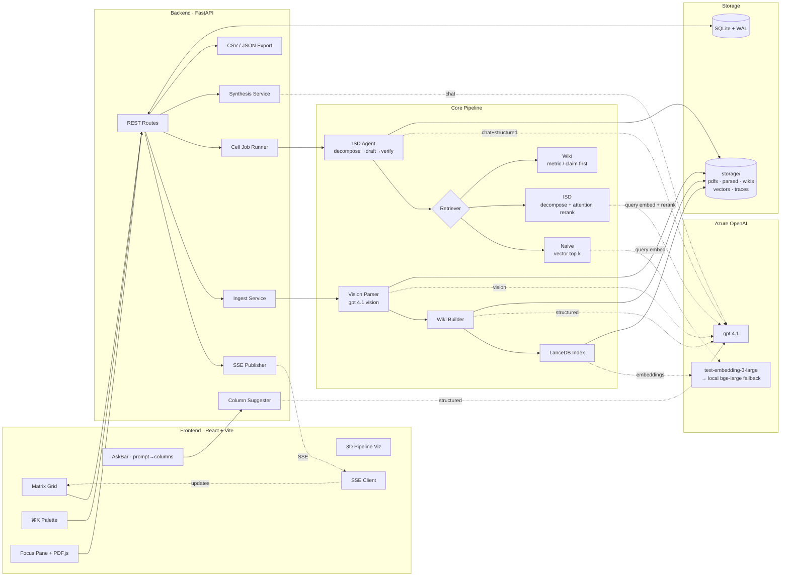
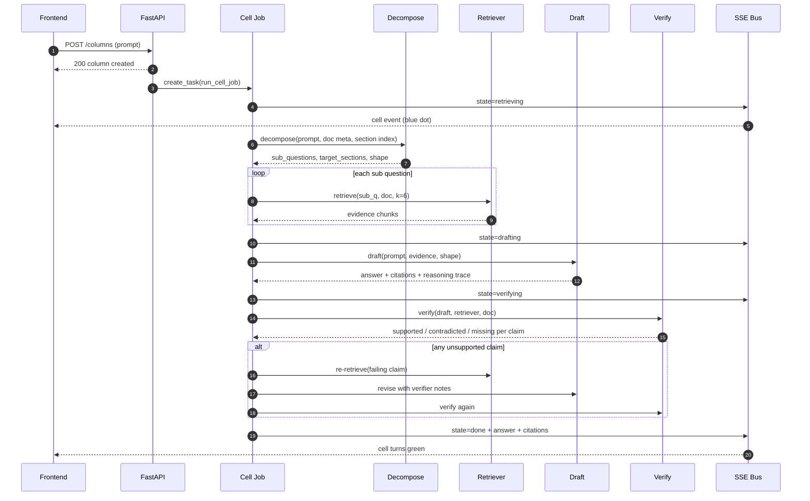
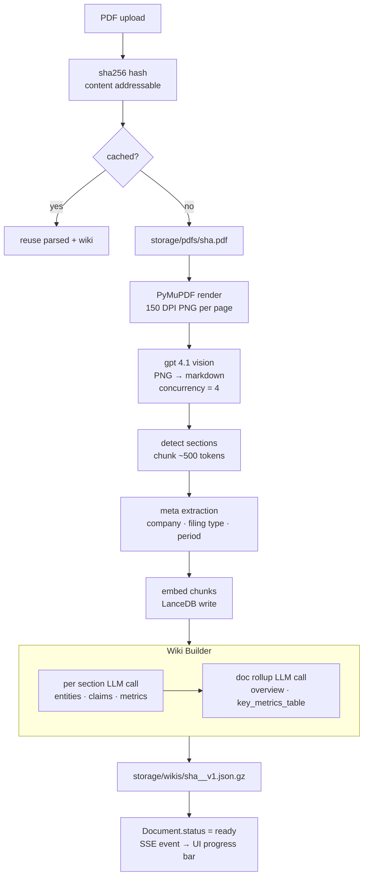
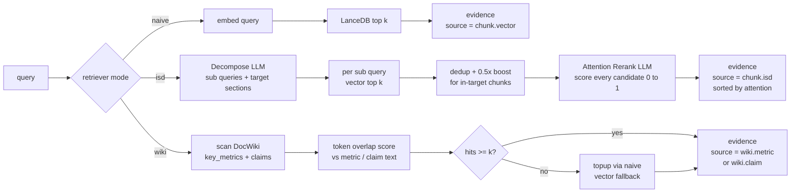
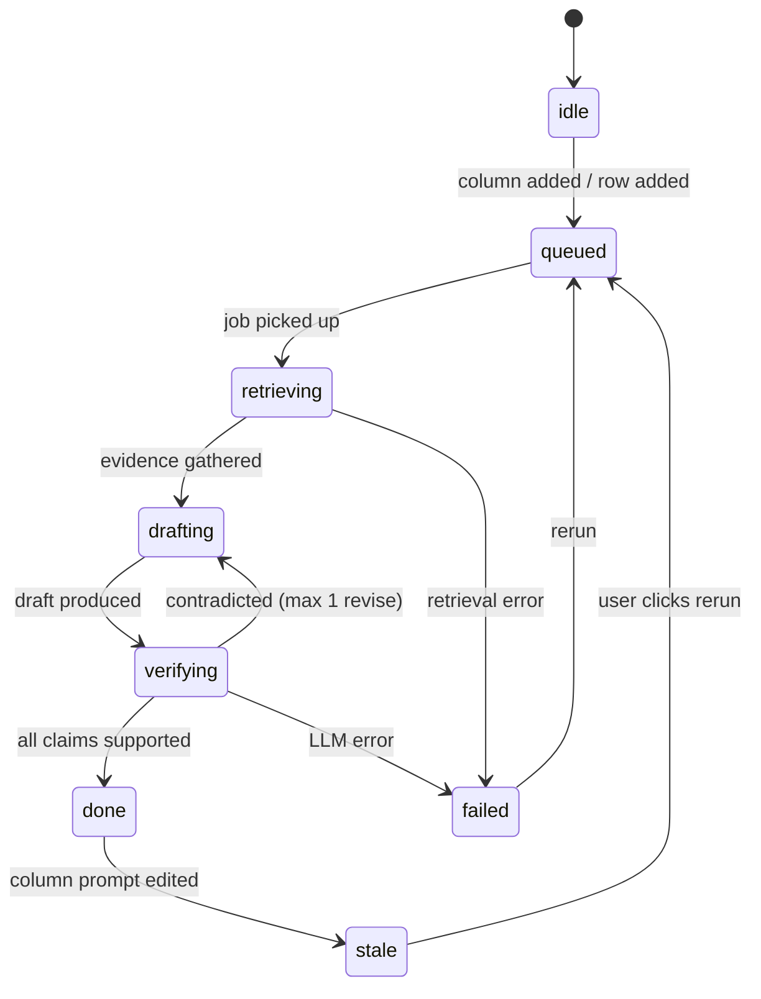
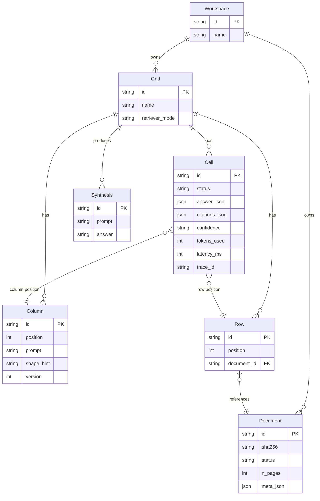

# MATRIX

> Hebbia Matrix style spreadsheet over PDFs. Drop financial filings, define prompt columns, watch cells stream answers with inline citations. Three swappable retrievers. FinanceBench benchmark harness.

## Overview

Matrix turns unstructured PDFs into a structured, queryable grid. Each row is a document, each column is a prompt, each cell streams an answer with citations linking back to the exact PDF page.

Under the hood: **vision based parsing** (gpt 4.1 renders each page to markdown), **three swappable retriever tiers**, a **per cell ISD agent** that decomposes, drafts, verifies, and revises every answer, and a **per document Wiki** that pre extracts structured knowledge at ingest for high precision retrieval.

---

## Architecture



---

## Per Cell Query Flow (ISD Loop)

Every `(row, column)` cell runs this pipeline:



---

## Ingest Pipeline (Vision First)



---

## Three Retriever Tiers



---

## Cell State Machine



---

## Data Model



---

## Tech Stack

| Layer | Technology |
|---|---|
| Frontend | React 18 · Vite · TypeScript · Tailwind CSS v4 · TanStack Table |
| UI Components | cmdk (⌘K palette) · Framer Motion · Lucide · PDF.js · three.js |
| State | Zustand · SSE (Server Sent Events) |
| Backend | Python 3.11+ · FastAPI · Uvicorn · async everywhere |
| Database | SQLite (WAL mode) via SQLModel · LanceDB (embedded vectors) |
| PDF Parsing | PyMuPDF (render only) → gpt 4.1 vision → markdown |
| Embeddings | Azure text-embedding-3-large → local BAAI/bge-large-en-v1.5 fallback |
| LLM | Azure OpenAI gpt 4.1 (chat + vision + structured output) |
| Logging | structlog (JSON) · per cell trace_id (ULID) |
| Benchmark | FinanceBench (PatronusAI) · LLM as judge · citation page recall |

---

## Setup

  Terminal 1 — Backend:
  cd "/Users/anup.roy/Downloads/Hebbia POC" && make backend

  Terminal 2 — Frontend (needs Node 22, make frontend won't work due to Node 18):
  cd "/Users/anup.roy/Downloads/Hebbia POC/frontend" && PATH="$HOME/.local/node22/bin:$PATH"
  pnpm dev

  Then open http://localhost:5173
  
```bash
cp .env.example .env       # set AZURE_OPENAI_API_KEY
cd backend && python3 -m venv .venv && . .venv/bin/activate && pip install -e ".[dev]"
cd ../frontend && pnpm install
```

## Run

Two terminals:

```bash
make backend     # http://127.0.0.1:8000
make frontend    # http://127.0.0.1:5173
```

Open **http://127.0.0.1:5173**.

## Demo Flow

1. **⌘K → Add documents** → select PDFs (samples included in `samples/`)
2. Watch the **ingest progress bar** stream live (per page vision progress)
3. **AskBar**: type *"give me a financial summary"* → click **suggest columns** → **add all**
4. Watch cells stream: `queued → retrieving → drafting → verifying → done`
5. Click any cell → **Focus pane** with answer, citations, PDF viewer with bbox overlay
6. Click **✦ 3D** → live 3D pipeline visualization
7. **Synthesis dock** (bottom) → cross row narrative with cell citations
8. **CSV** button (top bar) → structured export for downstream analytics

## Benchmark

```bash
cd backend && . .venv/bin/activate
python -m app.bench.run --modes naive,isd,wiki --limit 50 --out bench/results/run1
cat bench/results/run1/report.md
```

Emits JSONL per mode + markdown comparison: correctness (LLM judge), citation page recall / precision, latency, tokens.

## Tests

```bash
make test        # 23 backend tests, all hermetic
```

## Project Layout

```
backend/
  app/
    agent/          # decompose → draft → verify → revise cell loop
    api/            # FastAPI routes + SSE + export
    bench/          # FinanceBench harness
    jobs/           # token bucket budget
    parser/         # vision PDF → markdown → sections + chunks
    retriever/      # naive, isd (attention rerank), wiki
    services/       # ingest, events, cell jobs, synthesis, suggest
    storage/        # SQLModel tables
    wiki/           # per doc wiki builder
frontend/
  src/
    api/            # client + types
    components/     # TopBar, AskBar, Matrix, Cell, CommandBar,
                    # FocusPane, PdfView, SynthesisDock,
                    # IngestProgress, FlowOverlay, IngestFlowOverlay
    store/          # Zustand grid store with ingest tracking
docs/
  architecture.md   # Mermaid diagrams (this README has them inline too)
  specs/            # Design spec
  plans/            # Implementation plan
  progress.md       # Phase by phase build log
samples/            # Demo 10-K PDFs (AMD, NVIDIA, Netflix, Ferrari)
scripts/            # PDF generator, status doc builder
```

## Key Features

**Vision First Parsing** — No fragile text extraction. Every page rendered to PNG, sent to gpt 4.1 vision, returned as clean markdown. Tables, footnotes, charts handled natively.

**ISD Retrieval (Hebbia Pattern)** — Decompose query into sub queries + identify target sections from the wiki index. Embed and gather candidates. One batched attention rerank LLM call scores every candidate 0 to 1. Two LLM calls per retrieve regardless of pool size.

**Per Document Wiki** — At ingest, gpt 4.1 extracts per section: summary, entities, claims with evidence chunk ids, quantitative metrics. Doc level rollup: overview + key_metrics_table. WikiRetriever queries this structured knowledge first, falls back to vectors.

**Verify Loop** — Every drafted answer is claim checked: re retrieve evidence per claim, ask "does this support or contradict?". Unsupported claims trigger one revision pass. Confidence flagged if second pass fails.

**Live Streaming** — SSE per grid for cell state transitions. SSE per workspace for ingest progress (per page during vision). Zustand store merges events in real time.

**Query Decomposition** — AskBar: natural language → gpt 4.1 decomposes into 4 to 8 concrete column prompts with shape hints. One click to accept all.

**Structured Export** — CSV / JSON export keyed by issuer, metric, period, value, confidence, source pages. Ready for NAV returns pipelines or downstream analytics.

**3D Pipeline Visualization** — three.js scene showing the ISD loop (or ingest pipeline) as animated nodes with particle flow, driven by real SSE events. Click nodes for stage details.

## License

Internal use only.
