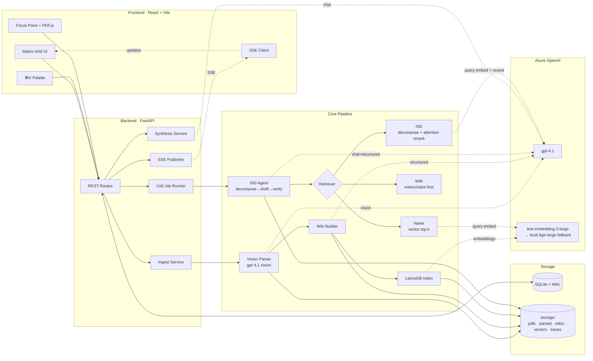
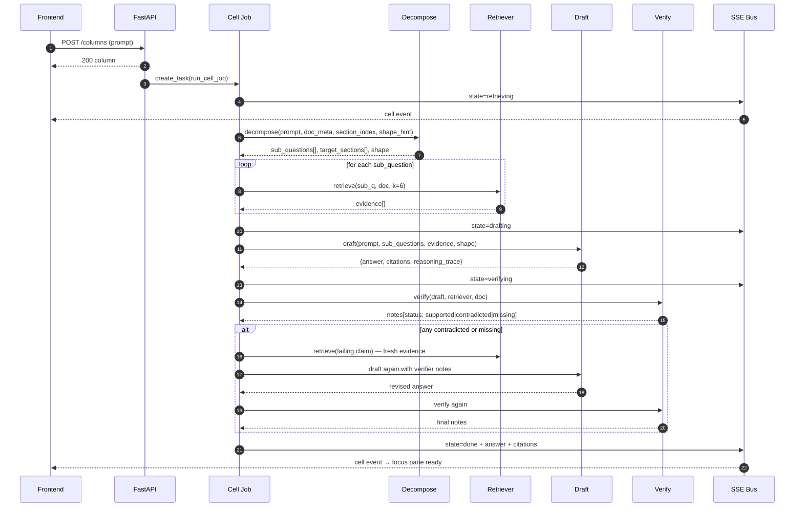
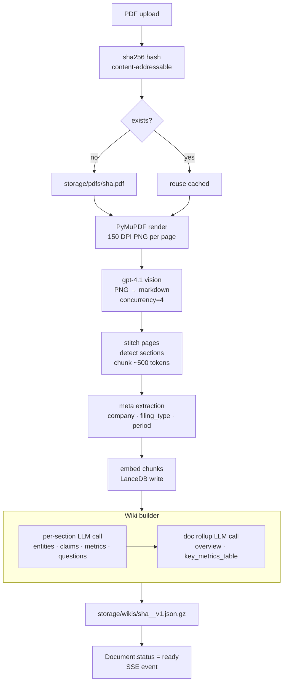
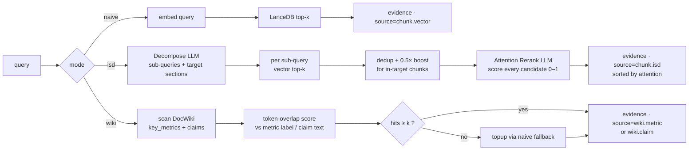
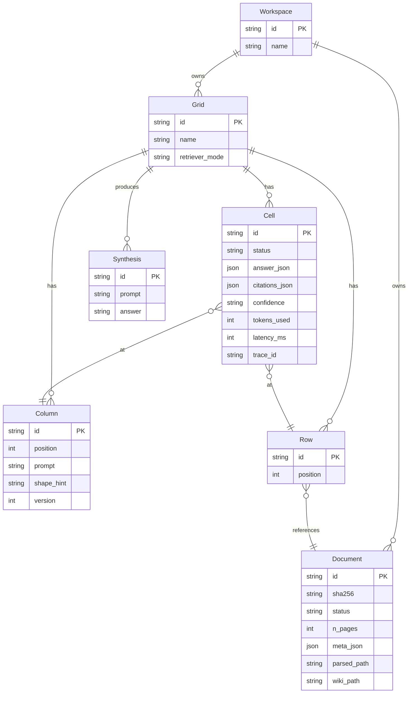
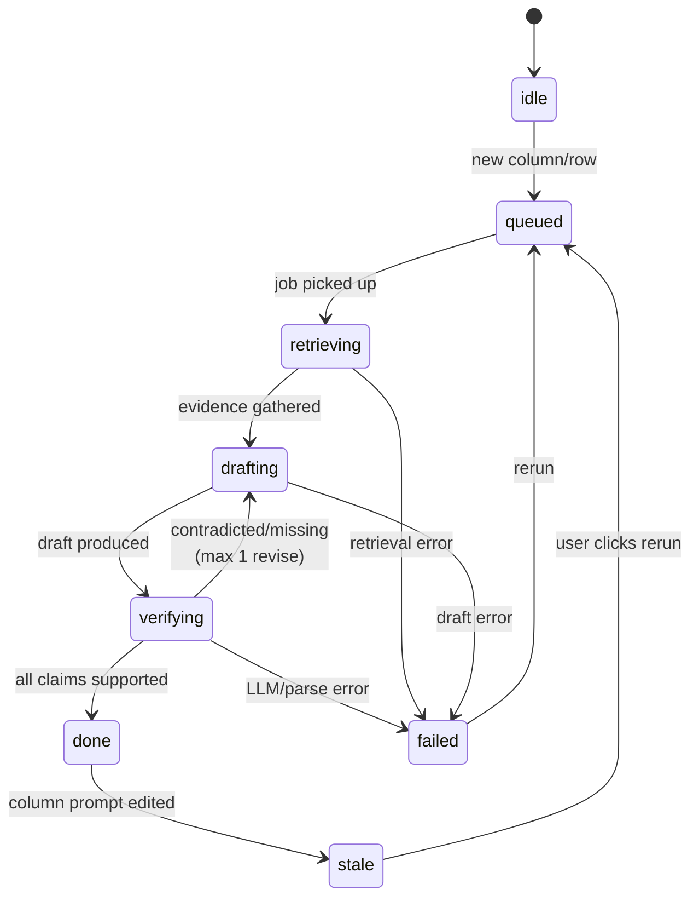

# Matrix PoC — Architecture

Paste any of these Mermaid blocks into https://mermaid.live or view directly in GitHub / VS Code (with the Mermaid extension).

---

## 1. System overview

---

## 2. Per-cell query flow (the ISD loop)

This is what happens for each `(row, column)` cell.

---

## 3. Ingest pipeline (vision-first)

---

## 4. Retriever comparison (the three tiers)

---

## 5. Data model (SQLite)

---

## 6. Cell state machine

